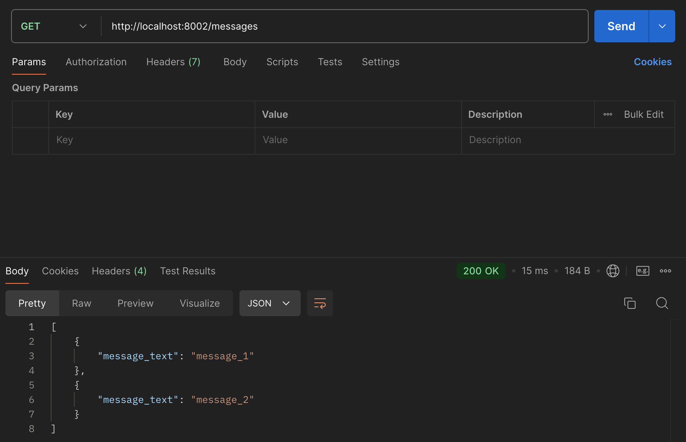

# Replicated log

Replicated log of messages between the master and the secondaries
## Configuration

Before the start, please set the following environment variables:
1. In the `master/.env` file:
    - `USE_SENTRY` - to enable Sentry logging (default: `false`, can be set to `true`)
    - `SENTRY_DSN` - to set the Sentry DSN (default: `""`)
2. In the `secondary/.env` file:
    - `MINIMUM_SECONDS_BETWEEN_MESSAGES` - to set the minimum seconds between messages (default: `2`)
    - `MAXIMUM_SECONDS_BETWEEN_MESSAGES` - to set the maximum seconds between messages (default: `4`)
3. In the `./.env` for docker compose file:
    - you can copy `.env.example` to `.env`
    - `NUMBER_OF_SECONDARIES` - to set the number of secondary instances (default: `3`)
    - `PROJECT_NAME` - to set the project name (is used for the recognition of the secondary instances by the master)
    - `SECONDARY_INTERNAL_PORT` - to set the internal port of the secondary instances (default: `8000`)
    - `MASTER_INTERNAL_PORT` - to set the internal port of the master instance (default: `8000`)

PROJECT NAME is set automatically via the following script
```bash
./append_project_name.sh
```

## Running

```bash
docker compose up --build
```

## Endpoints
### Master
- `GET /health` - to check the health of the master
- `GET /messages` - to get the messages from the master
- `POST /messages` - to send the message to the master

### Secondary
- `GET /health` - to check the health of the secondary
- `GET /messages` - to get the messages from the secondary
- `POST /internal/messages` - to send the message to the secondary (internal masters endpoint)

Message format:
```json
{
    "message_text": "message 1"
}
```
Additional fields in the message will be introduced later.

### Example of logs


### example of postman
Adding new message, and then reading all messages from the master and secondaries 
|||
|-|-|
|||
|||


## Miscellaneous
Also, the files of kubernetes configuration files are provided, as an alternative to run the application with recognizable secondaries and their addresses. Could be used later
